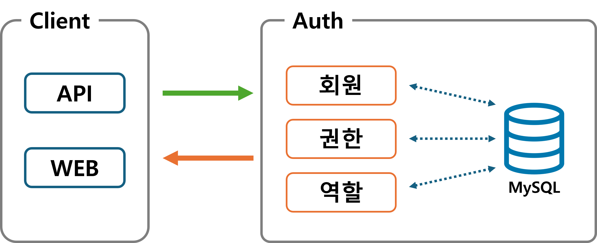

# Auth

## 1. 버전
- 1.0.0

## 2. 설명
- `사용자`는 회원이 아닌 일반 사용자, 회원, 관리자를 모두 포함한다.
- Auth(v.1.0.0)는 `사용자 정보`를 관리하는 웹 애플리케이션이다.
- 대부분의 애플리케이션(포털, 커뮤니티 등)에서 공통적으로 수행되는 기능을 구현한 애플리케이션이다.
- 그러므로 프로젝트를 설치하는 것만으로 회원 가입, 탈퇴, 로그인, 로그아웃, 정보 조회 및 수정 등 회원 정보나 사용자 정보를 관리하는 기능을 자동으로 제공해준다.
- 또한 각 애플리케이션마다 회원 관리를 위한 추가 과정이 필요한 경우 최소한의 개발을 통해 기능을 구현할 수 있도록 확장성을 제공한다.
- 단, Auth(v.1.0.0)는 RESTful API를 통해서 동작을 실행되며, 문서화 된 API 명세서를 통해 서비스를 이용하는 방법을 안내하고 있다.
- Auth(v.1.0.0)에서 제공되는 서비스는 다음 `3. 목표 기능`을 통해 확인할 수 있다.

## 3. 목표 기능
- 구현된 모든 기능은 `API를 통해서 실행`되며, 모든 결과는 `JSON 형식으로 반환`한다.
- 사용자가 API를 통해 서비스를 실행할 경우 `모든 사용 이력`을 저장한다.
- 회원 가입을 위한 '정보 제공 동의' 목록을 사용자에게 제공한다.
- 회원 가입 시 '정보 제공 동의 여부'를 입력받아 회원가입 절차를 진행하며, 동의 여부는 'Y' 또는 'N'으로 전달받는다.
- 회원 정보 상세 조회, 회원 목록 조회 기능을 제공한다.
- 회원 정보 수정 기능을 제공한다.
- ID 찾기, 비밀번호 찾기 기능을 제공한다.
- ID 찾기의 결과는 ID 앞자리 3개만 정상적으로 출력하고 나머지는 별표(*)로 표시된다.
- 비밀번호 찾기 기능의 결과로 임시 비밀번호를 발급한다.
- 임시 비밀번호로 로그인을 할 경우 "임시 비밀번호로 로그인이 되었습니다. 비밀번호를 변경해주세요."라는 메시지를 사용자에게 전달한다.
- 비밀번호 변경 시 ID, 현재 비밀번호, 변경할 비밀번호, 변경할 비밀번호(2)를 입력받아 비밀번호를 변경한다.
- 최종 로그아웃 날짜를 기준으로 6개월 동안 로그인을 하지 않은 회원은 비활성화 된다.
- 회원은 API를 통해 비호라성화를 해제할 수 있다.
- 관리자는 회원을 등록할 수 있다.
- 관리자는 회원의 활성화/비활성화 기능 사용 여부를 결정할 수 있다.
- 관리자는 회원의 활성화/비활성화 기능을 사용할 경우 비활성화 기간을 지정할 수 있다.
- 관리자는 회원의 비활성화 또는 활성화를 직접 설정할 수 있다.
- 관리자는 회원 정보를 삭제할 수 있다.
- 관리자는 '정보 제공 동의' 내용을 수정, 삭제할 수 있다.

## 4. 시스템 구성도

## 5. 기술 스택
- Language
    - Java 17
- Framework
    - Spring Boot 3.5.0
- Database
    - MySQL
    - MyBatis
- Documentation
    - SpringDocs
- Test
    - JUnit
    - Postman