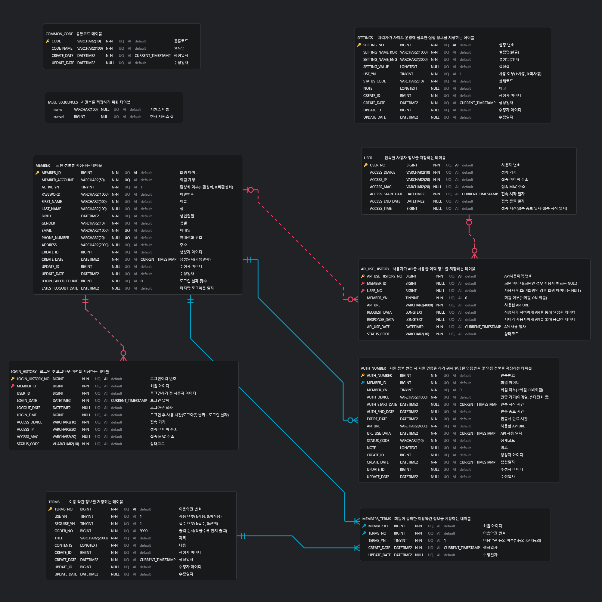

# 테이블 목록

|테이블명(한글)|테이블명(영어)|설명|비고|
|---|---|---|---|
|공통코드|COMMON_CODE|프로젝트에서 공통적으로 사용하는 코드를 저장하는 테이블|-|
|테이블시퀀스|TABLE_SEQUENCES|시퀀스를 저장하기 위한 테이블|-|
|사용자|USER|로그인을 하지 않은 모든 사용자들의 정보(IP, MAC, 접속날짜 등)를 저장하는 테이블|-|
|회원|MEMBER|회원가입한 사용자들의 정보(ID, 계정, 비밀번호, 이름 등)를 저장하는 테이블|-|
|이용약관|TERMS|회원가입 시 정보 수집 및 이용에 대한 약관 내용을 저장하는 테이블|-|
|로그인이력|LOGIN_HISTORY|회원이 로그인 및 로그아웃 한 이력을 저장하는 테이블|-|
|API사용이력|API_USE_HISTORY|회원과 비회원 등 모든 사용자들이 API를 사용한 이력을 저장하는 테이블|-|
|인증번호|AUTH_NUMBER|회원 비밀번호 변경 또는 계정 활성화를 위해 전송되는 인증번호를 저장하는 테이블|-|
|설정|SETTINGS|관리자가 사이트의 설정 정보를 관리하기 위한 테이블|-|
<br/><br/>

# 테이블 정의

## 1. 공통코드
```sql
CREATE TABLE COMMON_CODE (
    CODE VARCHAR2(10) NOT NULL COMMENT '공통코드',
    CODE_NAME VARCHAR2(100) NOT NULL COMMENT '코드명',
    CREATE_DATE DATETIME2 NOT NULL DEFAULT CURRENT_TIMESTAMP COMMENT '생성일자',
    UPDATE_DATE DATETIME2 COMMENT '수정일자',
    CONSTRAINT CODE_PK PRIMARY KEY(CODE)
) ENGINE=INNODB DEFAULT CHARSET=UTF8MB4 COMMENT='공통코드 테이블';
```

## 2. 테이블시퀀스
- 테이블 생성
```sql
/* 시퀀스를 저장할 테이블 생성 */
CREATE TABLE TABLE_SEQUENCES (
    name VARCHAR(100) COMMENT '시퀀스 이름',
    currval BIGINT UNSIGNED COMMENT '현재 시퀀스 값'
) ENGINE=INNODB COMMENT='시퀀스를 저장하기 위한 테이블';
```

- 시퀀스 생성을 위한 프로시저 작성(MySQL 기준)
```sql
/* 시퀀스 생성을 위한 CREATE_SEQ 프로시저 정의 */
CREATE PROCEDURE CREATE_SEQ (in seq_name VARCHAR(50))
MODIFIES SQL DATA
DETERMINISTIC
BEGIN
    DELETE FROM TABLE_SEQUENCES WHERE name = seq_name;
    INSERT INTO TABLE_SEQUENCES VALUES(seq_name, 0);
END
```

- 시퀀스 활용을 위한 함수(NEXTVAL, CURRVAL) 작성(MySQL 기준)
```sql
/* 함수를 생성할 수 있도록 권한 부여 */
show global variables like 'log_bin_trust_function_creators'; -- off
set global log_bin_trust_function_creators=ON;

/* NEXTVAL 함수 생성 */
CREATE FUNCTION NEXTVAL (seq_name VARCHAR(50))
RETURNS BIGINT UNSIGNED
MODIFIES SQL DATA
DETERMINISTIC
BEGIN
    DECLARE RET BIGINT UNSIGNED;
    UPDATE TABLE_SEQUENCES SET currval = currval + 1 WHERE name = seq_name;
    SELECT currval INTO RET FROM TABLE_SEQUENCES WHERE name = seq_name;
    RETURN RET;
END

/* CURRVAL 함수 생성 */
CREATE FUNCTION CURRVAL (seq_name VARCHAR(50))
RETURNS BIGINT UNSIGNED
MODIFIES SQL DATA
DETERMINISTIC
BEGIN
    DECLARE RET BIGINT UNSIGNED;
    SELECT currval INTO RET FROM TABLE_SEQUENCES WHERE name = seq_name;
    RETURN RET;
END
```

- 시퀀스 생성 및 조회 테스트
```sql
/* 이용약관 시퀀스 생성 */
CALL CREATE_SEQ('terms_of_use_seq');  -- 운영용 시퀀스(101번~)
CALL CREATE_SEQ('terms_of_use_test_seq');  -- 테스트용 시퀀스(1~100번)

/* 다음 시퀀스 값 가져오기 테스트 */
SELECT NEXTVAL('terms_of_use_test_seq') FROM DUAL;

/* 현재 시퀀스 값 가져오기 테스트 */
SELECT CURRVAL('terms_of_use_test_seq') FROM DUAL;
```

## 3. 사용자
```sql
CREATE TABLE USER (
    USER_NO BIGINT NOT NULL AUTO_INCREMENT COMMENT '사용자 번호',
    ACCESS_DEVICE VARCHAR2(10) NOT NULL COMMENT '접속 기기',
    ACCESS_IP VARCHAR2(20) NOT NULL COMMENT '접속 아이피 주소',
    ACCESS_MAC VARCHAR2(20) COMMENT '접속 MAC 주소',
    ACCESS_START_DATE DATETIME2 NOT NULL DEFAULT CURRENT_TIMESTAMP COMMENT '접속 시작 일자',
    ACCESS_END_DATE DATETIME2 COMMENT '접속 종료 일자',
    ACCESS_TIME BIGINT COMMENT '접속 시간(접속 종료 일자-접속 시작일자)',
    CONSTRAINT USER_PK PRIMARY KEY(USER_NO)
) ENGINE=INNODB DEFAULT CHARSET=UTF8MB4 COMMENT='접속한 사용자 정보를 저장하는 테이블';
```

## 4. 회원
```sql
CREATE TABLE MEMBER (
    MEMBER_ID BIGINT NOT NULL AUTO_INCREMENT COMMENT '회원 아이디',
    MEMBER_ACCOUNT VARCHAR2(50) UNIQUE NOT NULL COMMENT '회원 계정',
    ACTIVE_YN TINYINT NOT NULL DEFAULT 1 COMMENT '활성화 여부(1:활성화, 0:비활성화)',
    PASSWORD VARCHAR2(1000) NOT NULL COMMENT '비밀번호',
    FIRST_NAME VARCHAR2(500) NOT NULL COMMENT '이름',
    LAST_NAME VARCHAR2(100) COMMNET '성',
    BIRTH DATETIME2 NOT NULL COMMENT '생년월일',
    GENDER VARCHAR2(10) NOT NULL COMMENT '성별',
    EMAIL VARCHAR2(1000) UNIQUE NOT NULL COMMENT '이메일',
    PHONE_NUMBER VARCHAR2(20) UNIQUE NOT NULL COMMENT '휴대전화 번호',
    ADDRESS VARCHAR2(2000) COMMENT '주소',
    CREATE_ID BIGINT NOT NULL COMMENT '생성자 아이디',
    CREATE_DATE DATETIME2 NOT NULL DEFAULT CURRENT_TIMESTAMP COMMENT '생성일자(가입일자)',
    UPDATE_ID BIGINT COMMENT '수정자 아이디',
    UPDATE_DATE DATETIME2 COMMENT '수정일자',
    LOGIN_FAILED_COUNT BIGINT DEFAULT 0 COMMENT '로그인 실패 횟수',
    LATEST_LOGOUT_DATE DATETIME2 COMMENT '마지막 로그아웃 날짜',
    CONSTRAINT MEMBER_PK PRIMARY KEY(MEMBER_ID)
) ENGINE=INNODB DEFAULT CHARSET=UTF8MB4 COMMENT='회원 정보를 저장하는 테이블';
```

## 5. 이용약관
```sql
/* 테이블 생성 */
CREATE TABLE TERMS (
    TERMS_NO BIGINT NOT NULL COMMENT '애플리케이션 이용 약관 번호, 1~100:테스트용 번호, 101~:운영데이터 번호',
    USE_YN TINYINT NOT NULL DEFAULT 1 COMMENT '사용 여부(1:사용, 0:미사용)',
    REQUIRE_YN TINYINT NOT NULL DEFAULT 1 COMMENT '필수 여부(1:필수, 0:선택)',
    ORDER_NO BIGINT NOT NULL DEFAULT 9999 COMMENT '출력 순서(작을수록 먼저 출력)',
    TITLE VARCHAR(2000) NOT NULL COMMENT '제목',
    CONTENTS LONGTEXT NOT NULL COMMENT '내용',
    CREATE_ID BIGINT NOT NULL COMMENT '생성한 회원 아이디',
    CREATE_DATE DATETIME NOT NULL DEFAULT CURRENT_TIMESTAMP COMMENT '생성일자',
    UPDATE_ID BIGINT COMMENT '수정한 회원 아이디',
    UPDATE_DATE DATETIME COMMENT '수정일자',
    CONSTRAINT TERMS_PK PRIMARY KEY(TERMS_NO)
) ENGINE=INNODB DEFAULT CHARSET=UTF8MB4 COMMENT='애플리케이션 이용 약관 정보를 저장하는 테이블';
```

## 6. 회원_이용약관
```sql
CREATE TABLE MEMBERS_TERMS (
    MEMBER_ID BIGINT NOT NULL COMMENT '회원 아이디',
    TERMS_NO BIGINT NOT NULL COMMENT '이용약관 번호',
    TERMS_YN TINYINT NOT NULL DEFAULT 1 COMMENT '이용약관 동의 여부(1:동의, 0:미동의)',
    CREATE_DATE DATETIME2 NOT NULL DEFAULT CURRENT_TIMESTAMP COMMENT '생성일자',
    UPDATE_DATE DATETIME2 COMMENT '수정일자',
    CONSTRAINT MEMBERS_TERMS_PK PRIMARY KEY(MEMBER_ID, TERMS_NO)
) ENGINE=INNODB DEFAULT CHARSET=UTF8MB4 COMMENT='회원이 동의한 이용약관 정보를 저장하는 테이블';
```

## 7. 로그인이력
```sql
CREATE TABLE LOGIN_HISTORY (
    LOGIN_HISTORY_NO BIGINT NOT NULL AUTO_INCREMENT COMMENT '로그인이력 번호',
    MEMBER_ID BIGINT NOT NULL COMMENT '회원 아이디',
    USER_ID BIGINT NOT NULL COMMENT '로그인하기 전 사용자 아이디',
    LOGIN_DATE DATETIME2 NOT NULL DEFAULT CURRENT_TIMESTAMP COMMENT '로그인 날짜',
    LOGOUT_DATE DATETIME2 COMMENT '로그아웃 날짜',
    LOGIN_TIME BIGINT COMMENT '로그인 후 사용 시간(로그아웃 날짜 - 로그인 날짜)',
    ACCESS_DEVICE VARCHAR2(10) NOT NULL COMMENT '접속 기기',
    ACCESS_IP VARCHAR2(20) NOT NULL COMMENT '접속 아이피 주소',
    ACCESS_MAC VARCHAR2(20) COMMENT '접속 MAC 주소',
    STATUS_CODE VARCHAR(10) NOT NULL COMMENT '상태코드',
    CONSTRAINT LOGIN_HISTORY_PK PRIMARY KEY(LOGIN_HISTORY_NO)
) ENGINE=INNODB DEFAULT CHARSET=UTF8MB4 COMMENT='로그인 및 로그아웃 이력을 저장하는 테이블';
```

## 8. API사용이력
```sql
CREATE TABLE API_USE_HISTORY (
    API_USE_HISTORY_NO BIGINT NOT NULL AUTO_INCREMENT COMMENT 'API사용이력 번호',
    USER_ID BIGINT NOT NULL COMMENT '사용자 아이디(회원인 경우 회원 아이디)',
    MEMBER_YN TINYINT NOT NULL DEFAULT 0 COMMENT '회원 여부(1:회원, 0:비회원)',
    API_URL VARCHAR2(4000) NOT NULL COMMENT '사용한 API URL',
    REQUEST_DATA LONGTEXT COMMENT '사용자가 서버에게 API를 통해 요청한 데이터',
    RESPONSE_DATA LONGTEXT COMMENT '서버가 사용자에게 API를 통해 응답한 데이터',
    API_USE_DATE DATETIME2 NOT NULL DEFAULT CURRENT_TIMESTAMP COMMENT 'API 사용 일자',
    STATUS_CODE VARCHAR(10) NOT NULL COMMENT '상태코드',
    CONSTRAINT API_USE_HISTORY_PK PRIMARY KEY(API_USE_HISTORY_NO)
) ENGINE=INNODB DEFAULT CHARSET=UTF8MB4 COMMENT='사용자가 API를 사용한 이력 정보를 저장하는 테이블';
```

## 9. 인증번호
```sql
CREATE TABLE AUTH_NUMBER (
    AUTH_NUMBER BIGINT NOT NULL COMMENT '인증번호',
    MEMBER_ID BIGINT NOT NULL COMMENT '회원 아이디',
    MEMBER_YN TINYINT NOT NULL DEFAULT 0 COMMENT '회원 여부(1:회원, 0:비회원)',
    AUTH_DEVICE VARCHAR2(1000) NOT NULL COMMENT '인증 기기(이메일, 휴대전화 등)',
    AUTH_START_DATE DATETIME2 NOT NULL DEFAULT CURRENT_TIMESTAMP COMMENT '인증 시작 시간',
    AUTH_END_DATE DATETIME2 COMMENT '인증 종료 시간',
    EXFIRE_DATE DATETIME2 NOT NULL COMMENT '인증번호 만료 시간',
    API_URL VARCHAR2(4000) NOT NULL COMMENT '사용한 API URL',
    API_USE_DATE DATETIME2 NOT NULL DEFAULT CURRENT_TIMESTAMP COMMENT 'API 사용 일자',
    STATUS_CODE VARCHAR(10) NOT NULL COMMENT '상태코드',
    NOTE LONGTEXT COMMENT '비고',
    CREATE_ID BIGINT NOT NULL COMMENT '생성자 아이디',
    CREATE_DATE DATETIME2 NOT NULL DEFAULT CURRENT_TIMESTAMP COMMENT '생성일자',
    UPDATE_ID BIGINT COMMENT '수정자 아이디',
    UPDATE_DATE DATETIME2 COMMENT '수정일자',
    CONSTRAINT AUTH_NUMBER_PK PRIMARY KEY(AUTH_NUMBER, MEMBER_ID)
) ENGINE=INNODB DEFAULT CHARSET=UTF8MB4 COMMENT='회원 정보 변경 시 회원 인증을 하기 위해 발급된 인증번호 및 인증 정보를 저장하는 테이블';
```

## 10. 설정
```sql
CREATE TABLE SETTINGS (
    SETTING_NO BIGINT NOT NULL AUTO_INCREMENT COMMENT '설정 번호',
    SETTING_NAME_KOR VARCHAR2(1000) NOT NULL COMMENT '설정명(한글)',
    SETTING_NAME_ENG VARCHAR2(2000) NOT NULL COMMENT '설정명(영어)',
    SETTING_VALUE LONGTEXT COMMENT '설정값',
    USE_YN TINYINT NOT NULL DEFAULT 1 COMMENT '사용 여부(1:사용 0:미사용)',
    STATUS_CODE VARCHAR(10) NOT NULL COMMENT '상태코드',
    NOTE LONGTEXT COMMENT '비고',
    CREATE_ID BIGINT NOT NULL COMMENT '생성자 아이디',
    CREATE_DATE DATETIME2 NOT NULL DEFAULT CURRENT_TIMESTAMP COMMENT '생성일자',
    UPDATE_ID BIGINT COMMENT '수정자 아이디',
    UPDATE_DATE DATETIME2 COMMENT '수정일자',
    CONSTRAINT SETTINGS_PK PRIMARY KEY(SETTING_NO)
) ENGINE=INNODB DEFAULT CHARSET=UTF8MB4 COMMENT='관리자가 사이트 운영에 필요한 설정 정보를 저장하는 테이블';
```
<br/><br/>

# ERD


