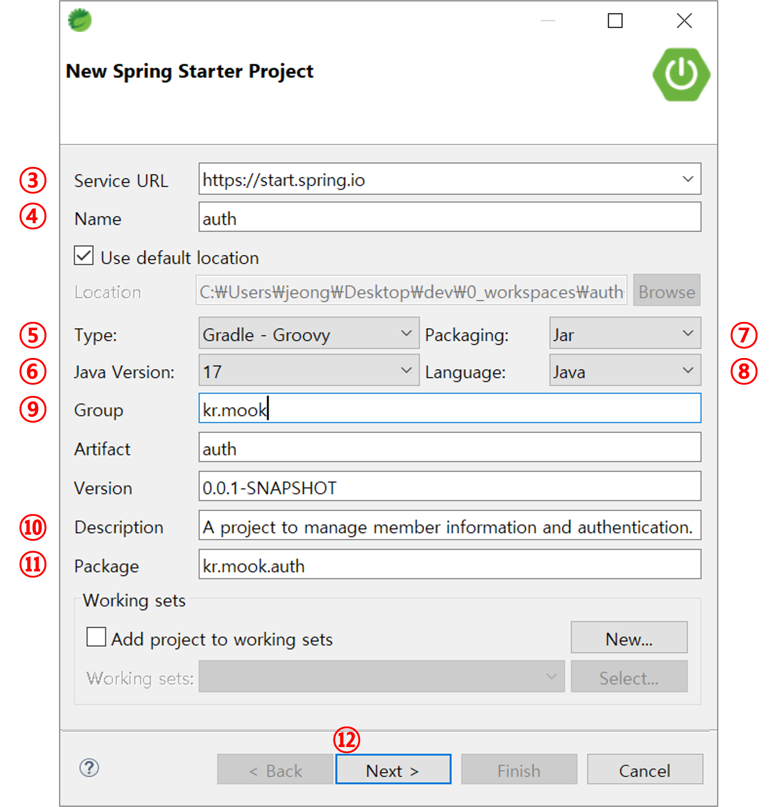

# 1. 프로젝트 생성


① 마우스 오른쪽키를 클릭한 후 `New` 메뉴를 선택합니다.

② `Spring Starter Projec` 메뉴를 선택합니다.




③ 프로젝트 생성 시 필요한 서비스를 제공해주는 URL입니다.

④ 프로젝트 이름을 입력합니다.

⑤ Repository 타입을 선택합니다.<br/>&emsp;Maven을 선택할 수도 있고 Gradle을 선택할 수도 있습니다.<br/>&emsp;이번 프로젝트에서는 Gradle을 사용할 것이기 때문에 `Gradle - Groovy`를 선택합니다.

⑥ 프로젝트에서 사용할 Java의 버전, 즉 JDK 버전을 선택합니다.

⑦ 프로젝트를 패키징할 때 어떤 확장자로 패키징할 것인지 선택합니다.<br/>&emsp;Jar로 패키징할 수도 있고 War로 패키징할 수도 있습니다.<br/>&emsp;이번 프로젝트에서는 Jar로 패키징할 수 있도록 선택합니다.

⑧ 프로젝트에서 사용할 언어를 선택합니다.

⑨ 프로젝트의 그룹명,Artifact를 입력합니다.<br/>&emsp;Version은 기본적으로 작성된 값을 그대로 사용합니다.

⑩ 프로젝트의 설명을 입력합니다.

⑪ 프로젝트의 최상위 패키지를 입력합니다.

⑫ Next 버튼을 통해 다음 단계를 진행합니다.


⑬ 스프링부트 버전을 선택합니다.

⑭ 프로젝트에 포함할 라이브러리를 선택합니다.<br/>&emsp;프로젝트에서 `Lombok`과 `Spring Rest Docs`를 사용할 것이기 때문에 모두 선택합니다.<br/>&emsp;웹 프로젝트 개발을 위해 기본적으로 필요한 `Spring Web` 라이브러리도 선택합니다.

⑮ 필요한 라이브러리가 있으면 직접 검색하여 추가할 수도 있습니다.

⑯ 프로젝트에 추가된 라이브러리들을 확인할 수 있습니다.

⑰ `Finish` 버튼을 클릭하여 프로젝트를 생성합니다.


⑱ 프로젝트가 정상적으로 만들어졌다면 위와 같은 패키지 구조도 생성되었는지 확인할 수 있습니다.

⑲ `build.gradle` 파일을 열면 아래와 같이 Spring boot 버전, JDK 버전, 그리고 프로젝트를 생성할 때 추가한 `Dependencies`를 확인할 수 있습니다.

```gradle
plugins {
	id 'java'
	id 'org.springframework.boot' version '3.5.4'
	id 'io.spring.dependency-management' version '1.1.7'
	id 'org.asciidoctor.jvm.convert' version '3.3.2'
}

group = 'kr.mook'
version = '0.0.1-SNAPSHOT'

/* JDK(Java) 버전 확인  */
java {
	toolchain {
		languageVersion = JavaLanguageVersion.of(17)
	}
}

configurations {
	compileOnly {
		extendsFrom annotationProcessor
	}
}

repositories {
	mavenCentral()
}

ext {
	set('snippetsDir', file("build/generated-snippets"))
}

/* Spring Web, Lombok, Spring REST Docs Dependencies 확인 */
dependencies {
	implementation 'org.springframework.boot:spring-boot-starter-web'
	compileOnly 'org.projectlombok:lombok'
    annotationProcessor 'org.projectlombok:lombok'
	testImplementation 'org.springframework.boot:spring-boot-starter-test'
	testImplementation 'org.springframework.restdocs:spring-restdocs-mockmvc'
	testRuntimeOnly 'org.junit.platform:junit-platform-launcher'
}

tasks.named('test') {
	outputs.dir snippetsDir
	useJUnitPlatform()
}

tasks.named('asciidoctor') {
	inputs.dir snippetsDir
	dependsOn test
}
```

<br/>

# 2. JDK 설정


① Spring Tool Suit(또는 Eclipse) 상단에 있는 `Window` 메뉴를 클릭합니다.

② Window 메뉴에 있는 `Preferences` 메뉴를 선택합니다.


③ Java의 하위 항목에서 `Installed JREs` 메뉴를 선택합니다.

④ 이번 프로젝트에서 JDK 17 버전을 사용할 예정이기 때문에 우측 화면에서 `jdk-17`을 선택해줍니다.<br/>&emsp;선택할 JDK가 없다면 `Add` 버튼을 클릭하여 사용할 JDK를 가져옵니다.

⑤ `Apply` 버튼을 눌러 `Installed JREs` 설정을 프로젝트에 적용합니다.


⑥ Java의 하위 항목에서 `Compiler` 메뉴를 선택합니다.

⑦ `Compiler compliance level'에서 JDK와 같은 17버전을 선택합니다.

⑧ `Apply` 버튼을 눌러 `Compiler` 설정을 프로젝트에 적용합니다.


⑨ Java의 하위 항목에서 `Gradle` 메뉴를 선택합니다.

⑩ Java home에 jdk 17 폴더 또는 JAVA_HOME 경로를 입력합니다.

⑪ `Apply` 버튼을 눌러 `Gradle` 설정을 프로젝트에 적용합니다.