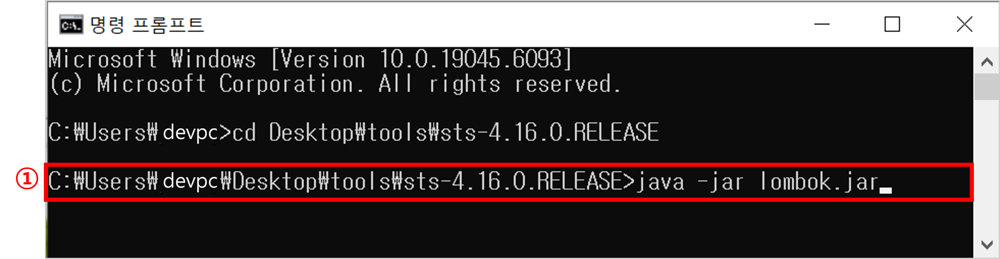

# 1. Lombok 다운로드


① `lombok.jar` 파일을 다운로드 받기 위해 `https://projectlombok.org/download`에 접속합니다.

② 홈페이지 중앙에 있는 `Download 1.18.38`를 클릭합니다.
<br/>&emsp;* 2025년 8월 7일 기준으로 Lombok의 최신 버전은 `1.18.38`이므로 `Download 1.18.38`라는 버튼이 출력되는 것입니다.

③ 파일을 다운로드 받은 폴더에 접근하면 `lombok.jar` 파일이 생성된 것을 확인할 수 있습니다.


④ 개발할 때 사용하는 IDE(이클립스, STS 등)가 위치한 경로에 접근합니다.

⑤ 다운로드를 받은 `lombok.jar` 파일을 IDE 경로에 복사합니다.


# 2. Lombok 설치



① 명령 프롬프트(CMD)를 열어 IDE 경로로 이동한 후 `lombok`을 설치하기 위해 아래 명령어를 입력합니다.
```cmd
java -jar lombok.jar
```


② 명령어를 실행하면 `Lombok`을 설치하기 위한 화면이 나타납니다.

③ Lombok이 IDE(이클립스, STS 등)를 찾을 수 없다는 경고 메시지가 출력됩니다.
<br/>IDE와 연결하기 위해 `OK` 버튼을 클릭합니다.

④ IDE 경로를 Lombok에게 알려주기 위해 `Specify location...` 버튼을 클릭합니다.


⑤ IDE가 설치된 경로에 접근하여 `IDE 실행 파일`을 클릭합니다.

⑥ `Select` 버튼을 클릭하여 Lombok을 설치할 IDE를 등록합니다.


⑦ `Install / Update` 버튼을 클릭하여 `Lombok 설치`를 진행합니다.


⑧ Lombok 설치가 완료되면 `Install successful` 화면이 나타납니다.

⑨ `Quit Installer` 버튼을 클릭하여 Lombok 설치를 마무리 합니다.

# 3. Gradle

⑩ IDE(이클립스, STS 등)를 열어 `build.gradle` 파일을 열어 아래와 같이 lombok 버전을 입력해줍니다.
<br/>* lombok 버전을 입력하지 않아도 lombok에서 제공해주는 기능을 사용할 수 있습니다.

```gradle
dependencies {
	compileOnly 'org.projectlombok:lombok:1.18.38'
    annotationProcessor 'org.projectlombok:lombok:1.18.38'
    ...
}
```


⑪ lombok 버전을 입력했다면 `build.gradle` 폴더에서 마우스 오른쪽 버튼을 누른 뒤 `Gradle` 메뉴를 선택합니다.

⑫ `Gradle` 메뉴를 선택하면 `Refresh Gradle Project` 메뉴가 나타납니다.
<br/>&emsp;`Refresh Gradle Project` 메뉴를 클릭하여 변경된 dependencies를 프로젝트에 적용합니다.

# 4. Lombok을 활용한 소스코드 작성


① 소스코드에서 DTO를 작성할 때 이미지와 같이 Lombok을 활용할 수 있습니다.

② DTO의 인스턴스를 생성할 때에도 Lombok의 기능을 활용하여 쉽게 개발할 수 있습니다.
<br/>&emsp;여기까지 잘 진행하였다면 `Lombok 설치`가 끝났으며, Lombok을 활용하여 개발할 준비가 되었습니다.